# Project: Pewlett Hackard Employee Database

## Objectives: 
* Research employees of corporation from the 1980's and 1990's using 6 CSV files that remain from that period. 
* Design tables to hold and import data into a SQL database.
* Conduct queries about the data.
* Use Pandas to connect to SQL database to plot charts

## Tools:
* PostgreSQL
* pgAdmin 4
* Jupyter Lab
* Libraries: SQLAlchemy, Pandas, Matplotlib, Scipy, Numpy

## Assignment:

Data Modeling: 
* Inspect the CSVs and sketch out an ERD of the tables using [http://www.quickdatabasediagrams.com](http://www.quickdatabasediagrams.com).

Data Engineering:
* Use the information to create a table schema for each of the six CSV files, specifying data types, primary keys, foreign keys, and other constraints. 

* Import each CSV file into the corresponding SQL table. 

Data Analysis:
1. List the following details of each employee: employee number, last name, first name, sex, and salary.
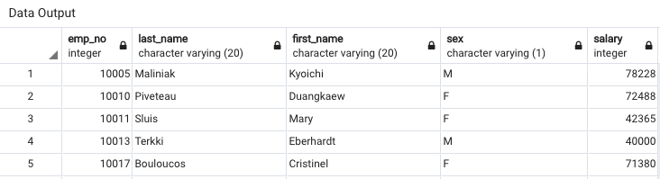

2. List first name, last name, and hire date for employees who were hired in 1986.
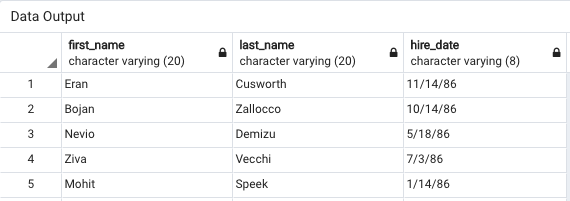

3. List the manager of each department with the following information: department number, department name, the manager's employee number, last name, first name.
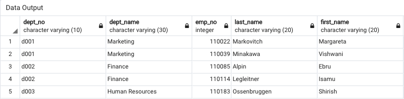

4. List the department of each employee with the following information: employee number, last name, first name, and department name.
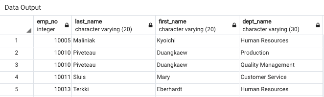

5. List first name, last name, and sex for employees whose first name is "Hercules" and last names begin with "B."
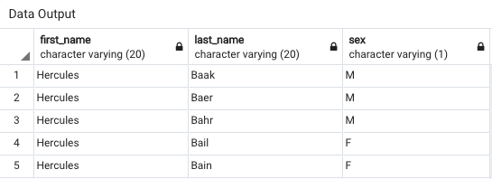

6. List all employees in the Sales department, including their employee number, last name, first name, and department name.
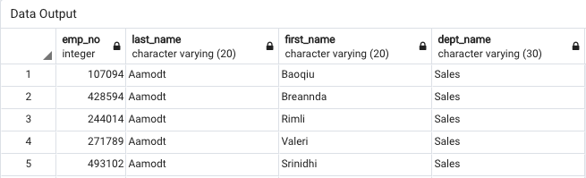

7. List all employees in the Sales and Development departments, including their employee number, last name, first name, and department name.
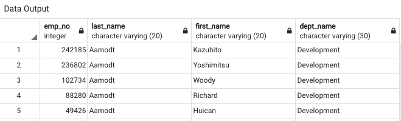

8. In descending order, list the frequency count of employee last names, i.e., how many employees share each last name.
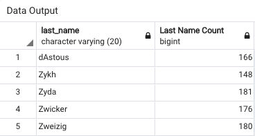

Visualization:
* Import SQL database into Pandas.
* Create a histogram to visualize the most common salary ranges for employees.
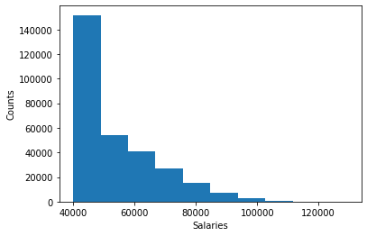

* Create a bar chart of average salary by title.
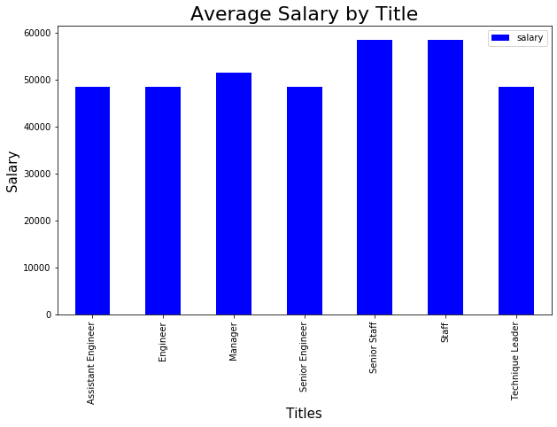

## Outputs

* Create an image file of ERD.
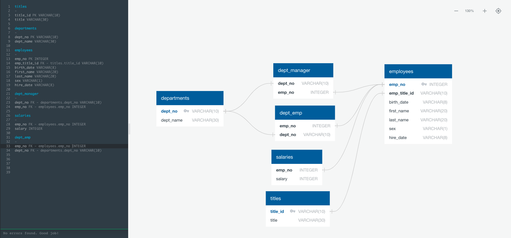

* Create a `.sql` file of table schemata.
* Create a `.sql` file of queries.
* Create a Jupyter Notebook of visualizations.